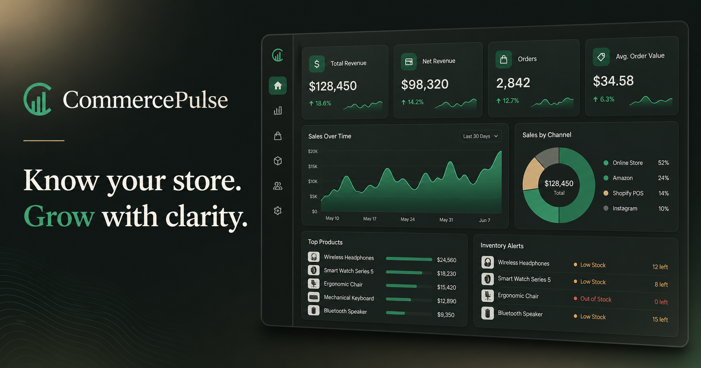

# CommercePulse

A premium e-commerce analytics dashboard that helps store owners understand revenue, orders, customers, product performance, sales channels, and inventory health.



## Features

- Revenue, order, customer, and conversion KPIs
- Interactive 7-day, 30-day, and 90-day reporting ranges
- Revenue and order-volume chart switching
- Sales-channel visualization
- Category-filtered product performance
- Inventory health and low-stock alerts
- Searchable recent-order table
- Working dark mode and responsive mobile navigation
- Export, notification, store, report, and product interactions

## Technology

- Next.js, React, and TypeScript
- Recharts for data visualization
- Lucide React icons
- Responsive CSS Grid and Flexbox
- Vinext and Cloudflare-compatible production build

## Run locally

```bash
npm install
npm run dev
```

Create a production build:

```bash
npm run build
```

## Portfolio purpose

CommercePulse demonstrates frontend skills for data-dense SaaS products: visual hierarchy, dashboard composition, chart integration, stateful filtering, responsive layout, interaction design, and production deployment.
